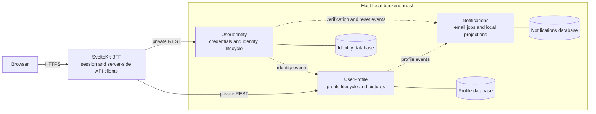
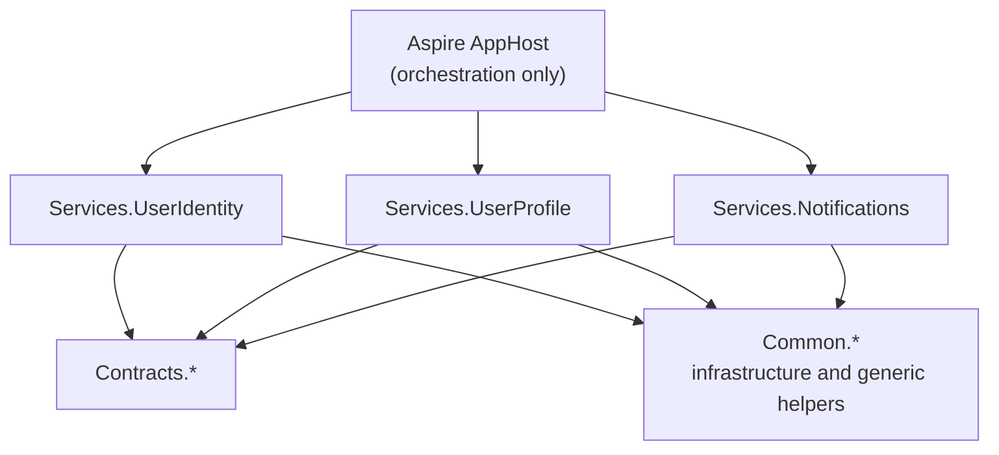
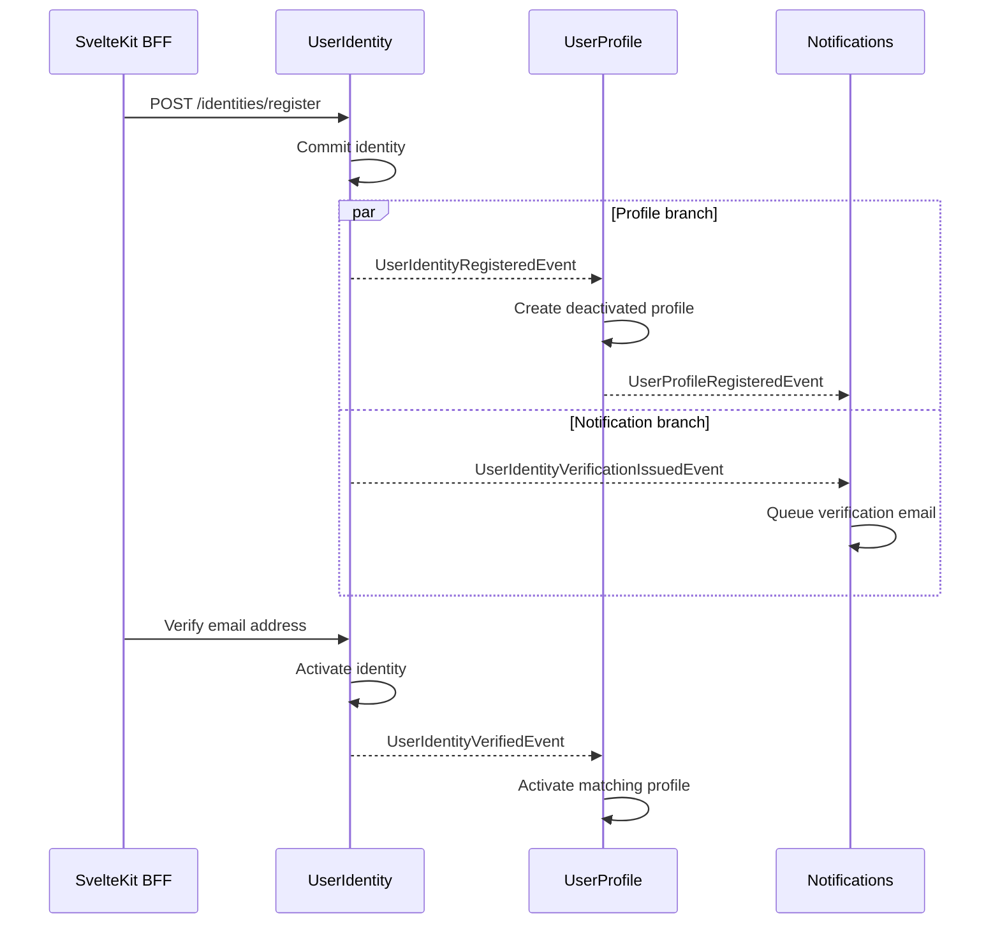
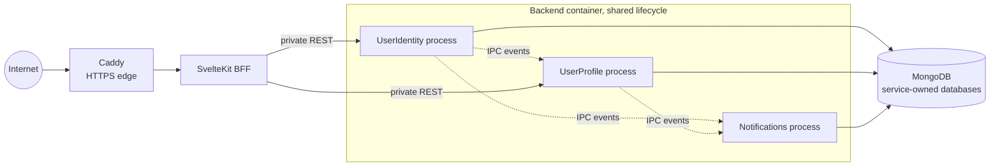

# HelpDesk

> **Hard service boundaries now. Broker infrastructure when it earns its keep.**

HelpDesk is a working demonstration of **Brokerless Microservice Mesh Architecture (BMMA)** built with .NET 10, FastEndpoints, MongoDB, Aspire, and a SvelteKit BFF. It explores a deliberate middle path for systems that have outgrown purely in-process boundaries but do not yet need Kafka, RabbitMQ, Azure Service Bus, or the operational model that comes with them.

BMMA Higlights:

- Business capabilities run in separate service processes
- Each service owns its code, logical database, REST surface, and failure handling
- Services collaborate through explicit, past-tense contract events
- No service calls another service's REST API to complete an internal workflow
- No central message broker is required

## Why this architecture exists

A modular monolith is often the right place to start. A brokered microservice platform is sometimes the right place to end up. The expensive mistake is assuming those are the only two choices. Typical characteristics look like this:

|                      | Modular monolith                  | Brokerless mesh                            | Brokered microservices                                             |
|----------------------|-----------------------------------|--------------------------------------------|--------------------------------------------------------------------|
| Runtime boundary     | One process                       | Separate processes on one host             | Separate processes, often across hosts                             |
| Collaboration        | In-process calls/events           | Direct event links with persisted queues   | Events through a central broker                                    |
| Data ownership       | Often shared, ideally modular     | Logically service-owned                    | Service-owned, often credential-isolated                           |
| Boundary enforcement | Primarily architecture discipline | Project and process boundaries             | Project, process, network, and persistence boundaries              |
| Operational cost     | Usually lowest                    | Moderate                                   | Usually highest                                                    |
| Best fit             | One deployment is enough          | Strong boundaries before distributed scale | Independent scale, multi-host resilience, rich broker capabilities |

The brokerless mesh is useful when the **shape of microservices** is valuable before the **infrastructure of distributed microservices** is justified.

That gives a team several practical benefits:

1. **Important boundaries are executable, not aspirational.** A service cannot reach into another service's DI container, domain entities, or persistence abstractions through a project reference. Database ownership remains a convention in the included shared-MongoDB topology.
2. **Business workflows are already asynchronous.** Adding a broker later does not require first untangling synchronous service call chains.
3. **Local development stays approachable.** Aspire starts the application, MongoDB, service processes, and frontend as one observable resource graph.
4. **The system pays for complexity gradually.** Network partitions, broker clusters, schema registries, and independent scaling arrive only when requirements make them worthwhile.

This is not an argument against brokers. It is an argument for introducing one at the point where its capabilities have a clear return.

---

The following sections talk only of the user onboarding/profile management flows such as: registration, email verification, login, password reset, profiles, profile pictures, and notification jobs. The BMMA architecture can be easily understood by looking at the onboarding flows alone.

> [!IMPORTANT]
> The current mesh transport is **host-local IPC**. Local development runs the services as separate processes under Aspire. Production co-locates them in one backend container with a shared lifecycle. Project and process boundaries are enforced; persistence ownership uses separate logical databases but shared MongoDB credentials in the included topologies. This repository does not currently provide multi-host transport or independent service scaling.

[Jump to the quickstart](#quickstart) if you want to run the system first.

---

## Architecture at a glance



The browser sees one application boundary. SvelteKit acts as a backend-for-frontend:

- Backend origins remain server-only;
- JWTs stay in an `HttpOnly` session cookie rather than browser JavaScript or storage;
- **Identity** and **Profile** services expose private REST APIs to the BFF;
- **Notifications** service has no public business API.

Inside the backend, REST stops at the owning service. Cross-service business flow only uses events.

## The rules that make the mesh work

The architecture depends less on a particular library than on a small set of hard rules.

### 1. Commit locally, then publish a fact

Events describe something that has already happened:

```text
persist identity
    then broadcast UserIdentityRegisteredEvent
    then broadcast UserIdentityVerificationIssuedEvent
```

They are not commands asking another service to complete the publisher's transaction. If publishing or handling is delayed, the publisher's state remains internally valid.

### 2. Subscribers change only what they own

A subscriber may update its own database, maintain a local projection, or queue its own work. It does not call back into the publisher to finish the workflow.

This avoids distributed request chains such as:

```text
Identity -> Profile -> Notifications -> Identity
```

Those chains look simple in a diagram but couple availability, latency, retries, and deployment order across every participant.

### 3. Contracts are public language, not shared domain

Contract projects contain only what services need to communicate:

```csharp
public sealed record UserIdentityRegisteredEvent(
    string UserIdentityId,
    string Email,
    DateTime RegisteredAt) : IEvent;
```

They do not contain persistence entities, stores, endpoints, handlers, SMTP logic, or a shared domain model.

### 4. Dependency direction is enforced



There are deliberately no project-reference arrows between service projects.

```text
Allowed:    AppHost      -> service hosts (orchestration only)
            Services     -> Contracts, Common

Forbidden:  Service A    -> Service B
            Contracts    -> Services
            Common       -> service-specific behavior
            Service REST -> another service's REST for internal workflows
```

## A workflow through the mesh

Registration shows how the rules compose into a business flow:



Each dashed cross-service arrow is a contract event. The BFF calls are REST, and each solid self-call is local state or local work. No distributed transaction coordinates the flow. The same model handles password-reset email, profile activation, and the Notifications service's local display-name projection. Handlers are designed around local ownership and idempotent behavior where duplicate delivery matters.

## What “brokerless” means here

Brokerless does **not** mean messaging-free, in-memory, or best-effort by definition.

HelpDesk uses FastEndpoints remote messaging:

- Each publisher exposes a stable IPC endpoint
- Publishers register event hubs and (optionally) known subscriber IDs
- Subscribers map handlers to the publisher by service name
- MongoDB-backed storage persists queued event records and subscriber state
- Events are broadcast only after the publisher's local write succeeds

The wiring is explicit:

```csharp
// publisher transport
options.ListenInterProcess(UserIdentityService.Name);

// publisher hub
handlers.RegisterEventHub<UserIdentityRegisteredEvent>();

// subscriber
app.MapRemote(UserIdentityService.Name, subscriber =>
{
    subscriber.Subscribe<UserIdentityRegisteredEvent, UserIdentityRegisteredEventHandler>();
});
```

Once an event has entered the queue, persisted records support delivery and retry without operating a separate broker. This design does not claim the complete feature set of Kafka, RabbitMQ, or a managed service bus. There is no claim of guaranteed publication, global ordering, exactly-once delivery, multi-region routing, or independently scalable consumers.

## When this pattern fits

Consider this architecture when:

- One machine or one deployment unit can comfortably run the system
- Code and domain ownership need stronger enforcement than ordinary module conventions
- Asynchronous workflows are desirable
- A central broker would be mostly operational/cost overhead today
- You want contracts and handlers that can survive a later transport change

Prefer a modular monolith when:

- One process and one deployment are genuine advantages
- Module boundaries can be maintained with code-level enforcement
- Asynchronous cross-module workflows add little value
- The team should optimize for the smallest possible operational surface

Introduce a broker or network-capable transport when:

- Services must run or scale independently across hosts
- Consumers need distributed coordination
- Multi-region routing, replay tooling, high fan-out, or broker-specific delivery controls matter
- Host-local availability and throughput are no longer sufficient

Graduating to a broker is an architecture evolution, not a configuration toggle. The event contracts, ownership rules, and most handlers should remain useful, but transport semantics, retries, observability, security, and deployment topology must be engineered deliberately.

## What the repository demonstrates

| Component          | Owns                                                            | Communicates through                                              |
|--------------------|-----------------------------------------------------------------|-------------------------------------------------------------------|
| **UserIdentity**   | Credentials, verification, password reset, RSA JWT issuance     | Private REST consumed by the BFF; identity events to the mesh     |
| **UserProfile**    | Profile lifecycle, display names, profile pictures              | Authenticated REST to BFF; identity subscriptions; profile events |
| **Notifications**  | Email jobs, SMTP integration, local display-name projection     | Identity and profile subscriptions; no public business API        |
| **SvelteKit BFF**  | Browser session boundary, forms, server-only API clients        | HTTPS to browser; private REST to Identity and Profile            |
| **Aspire AppHost** | Local resource graph, startup ordering, configuration injection | Development orchestration only                                    |

The sample is intentionally an onboarding vertical slice, not a complete multi-domain helpdesk product.

## Current runtime topology

The service boundaries and the deployment topology are separate concerns.

### Local development

Aspire runs MongoDB, the three .NET service processes, and Vite. It injects connection strings and private service origins, manages startup order, and exposes logs and dynamically assigned application endpoints in the Aspire dashboard.

### Production

The included Compose deployment targets a single VPS. Caddy is the only public edge. SvelteKit and MongoDB remain private. The three .NET services run as separate child processes inside one backend container so FastEndpoints IPC remains host-local.



This topology preserves code and process boundaries plus separate service-owned logical databases. Database ownership is not credential-isolated because the child processes share the production MongoDB connection. The backend services also share a deployment and lifecycle boundary. Splitting them across machines or containers requires switching to the "remote/gRPC" transport (instead of IPC) and corresponding deployment design which is not covered by the sample.

## Quickstart

### Prerequisites

- .NET 10 SDK
- Node.js 26 or newer (`.node-version` selects 26.4.0)
- pnpm 11 or newer (`packageManager` selects 11.10.0)
- an Aspire-compatible container runtime

### Install and run

```bash
corepack enable
corepack prepare pnpm@11.10.0 --activate
# If Corepack is unavailable: npm install --global pnpm@11.10.0

pnpm install --frozen-lockfile
pnpm stack:dev
```

`pnpm stack:dev` starts the full local application through `backend/AppHost`:

- Ephemeral authenticated MongoDB on `localhost:27017`
- UserIdentity, UserProfile, and Notifications
- The SvelteKit/Vite frontend
- The Aspire dashboard

Application HTTP ports are assigned dynamically. Open the frontend and service endpoints from the Aspire dashboard. Stop the stack with Ctrl+C.

Development suppresses SMTP delivery. After registering or requesting a password reset, open the Notifications resource logs in the Aspire dashboard and follow the logged verification or reset link.

Matching development-only RSA JWT material is committed in the backend appsettings so a fresh clone starts without secret generation. Never reuse those keys outside development. Production must override the Identity private key and Profile public key as a matching pair.

Identity and Profile expose OpenAPI at `/openapi/v1.json` and Scalar at `/scalar` outside Production.

### Validate the repository

The quick check covers frontend type checks, linting, formatting, and unit tests:

```bash
pnpm check:quick
```

Before the first full check, install Playwright's browser binaries once:

```bash
pnpm --dir frontend exec playwright install
```

Then keep `pnpm stack:dev` running in another terminal and run:

```bash
pnpm check:full
```

The full check adds frontend E2E and OpenAPI checks, MongoDB-backed backend tests, a Release build, and backend formatting. Backend tests use the Aspire-managed MongoDB instance on `localhost:27017`.

<details>
<summary>More development commands</summary>

```bash
pnpm backend:restore
pnpm backend:build
pnpm backend:build:release
pnpm backend:test
pnpm backend:format:check

pnpm frontend:dev
pnpm frontend:check
pnpm frontend:lint
pnpm frontend:format:check
pnpm frontend:test:unit
pnpm frontend:test:e2e
pnpm frontend:build
pnpm frontend:api:check
```

`pnpm frontend:dev` runs only the frontend. It is not an alternative full-stack orchestrator.

</details>

<details>
<summary>Refresh generated OpenAPI types</summary>

With the stack running, copy the Identity and Profile HTTP endpoints from the Aspire dashboard:

```bash
cd frontend
export IDENTITY_OPENAPI_URL='<identity-http-url>/openapi/v1.json'
export PROFILE_OPENAPI_URL='<profile-http-url>/openapi/v1.json'

pnpm api:refresh
pnpm api:generate
pnpm api:check
```

Snapshots remove runtime-specific `servers` entries so Aspire's dynamic ports do not create noisy diffs. Commit the snapshots and generated declarations together after intentional API changes.

</details>

## Repository tour

```text
HelpDesk/
|-- frontend/                 SvelteKit BFF and browser experience
|-- backend/
|   |-- AppHost/              Aspire local orchestrator
|   |-- Common/               Event storage-provider implementation and generic helpers
|   |-- Contracts/            Cross-service event language
|   |-- Services/             Identity, Profile, Notifications
|   `-- Deployment/           Production process launcher
|-- compose.yaml              Single-VPS production topology
|-- DEPLOYMENT.md             Deployment and operations guide
|-- HelpDesk.slnx
`-- package.json              Monorepo command surface
```

The most useful architecture entry points are:

- `backend/Contracts/*` for event contracts and subscriber IDs;
- `backend/Services/*/Program.cs` for hosts, event hubs, and subscriptions;
- `backend/Services/*/Subscriptions/` for reactions to remote events;
- `backend/AppHost/Program.cs` for the local resource graph;
- `frontend/src/lib/server/api/` for the BFF boundary.

## Production deployment

The included deployment is a pragmatic single-VPS topology with automatic HTTPS, private backend services, persistent MongoDB and profile-picture volumes, and optional SMTP. Email-driven onboarding is operational in Production only when SMTP is configured and enabled.

```bash
scripts/deploy-init.sh helpdesk.example.com
# Configure optional SMTP values in the generated .env
scripts/deploy.sh
```

Podman-only hosts can install the included systemd unit after a successful deployment:

```bash
scripts/install-host-service.sh
```

See [DEPLOYMENT.md](DEPLOYMENT.md) for provisioning, secrets, firewall guidance, HTTPS, upgrades, rollback, and host restart behavior.

## The idea worth taking away

The interesting part of HelpDesk is not simply that it removed a broker. It keeps the constraints that make event-driven services understandable: explicit ownership, facts after local commit, thin contracts, local subscriber effects, and no hidden synchronous RPC chains. Infrastructure can grow when requirements demand it.

## Further reading

| Resource                                                   | Purpose                                                             |
|------------------------------------------------------------|---------------------------------------------------------------------|
| [DEPLOYMENT.md](DEPLOYMENT.md)                             | Single-VPS deployment, secrets, HTTPS, and operations               |
| [`.okf/`](.okf/)                                           | Compact architecture, workflow, security, and operational knowledge |
| [`backend/Contracts/`](backend/Contracts/)                 | Cross-service event contracts                                       |
| [`backend/Services/`](backend/Services/)                   | Service implementations and subscription handlers                   |
| [`backend/AppHost/Program.cs`](backend/AppHost/Program.cs) | Aspire development resource graph                                   |